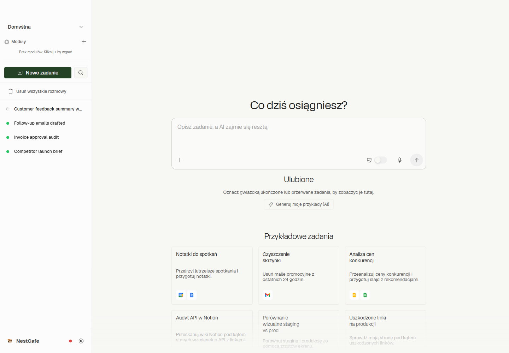
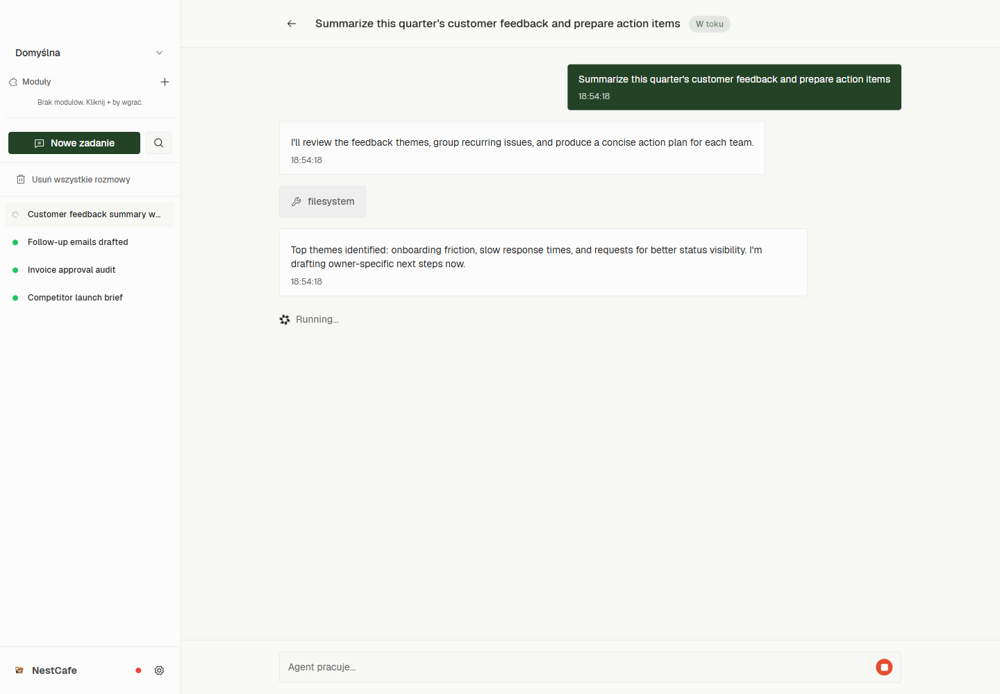
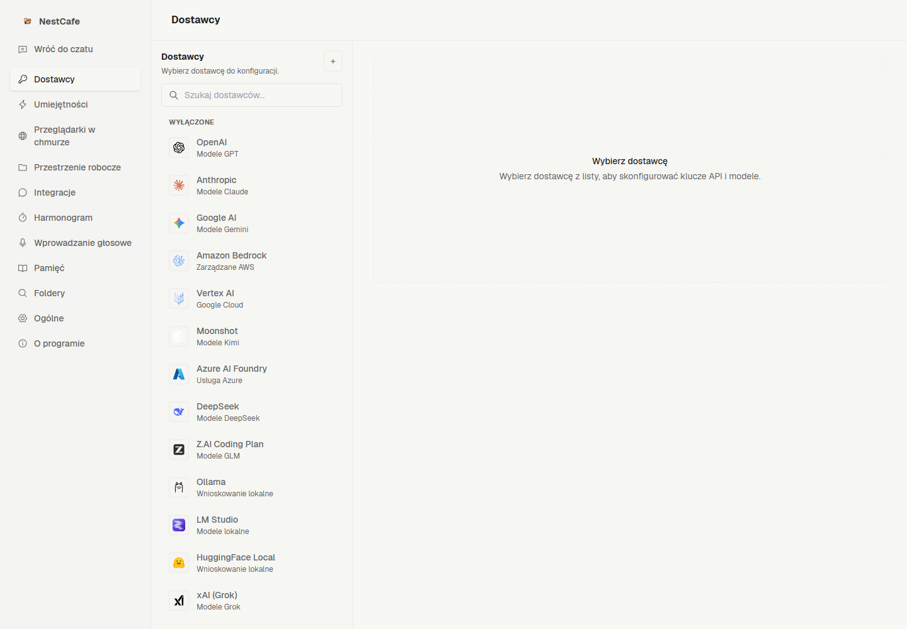
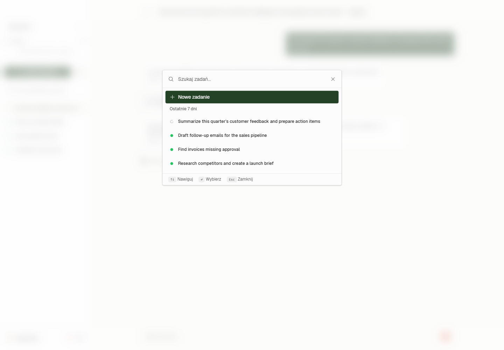

<p align="center">
  
  <h1 align="center">NestCafe</h1>
  <p align="center">
    <strong>Open-source AI assistant for your desktop</strong><br>
    Automate tasks, manage files, browse the web, handle email — all with AI agents running locally on your machine.
  </p>
</p>

<p align="center">
  <a href="#-quick-start">Quick Start</a> ·
  <a href="#-features">Features</a> ·
  <a href="#-supported-ai-providers">AI Providers</a> ·
  <a href="#-translations">Translations</a> ·
  <a href="#-architecture">Architecture</a> ·
  <a href="#-development">Development</a>
</p>

<p align="center">
  
  
  
  
  
  
</p>

---

## 🖼️ Screenshots

<p align="center">
  <i>📸 Add your screenshots here — replace the placeholders below</i>
</p>

| | |
|:---:|:---:|
| **Home — Task Input** | **Execution — AI at work** |
|  |  |
| **Settings — AI Providers** | **History — Past Tasks** |
|  |  |

> **To add screenshots:** Create a `screenshots/` folder in the repo root and add your PNG files: `home.png`, `execution.png`, `settings.png`, `history.png`.

---

## 🚀 Quick Start

### Prerequisites
- **Node.js 24+** — [Download](https://nodejs.org/)
- **pnpm 10.33+** — `npm install -g pnpm`
- **Windows**, macOS, or Linux

### Run in development mode

```bash
# Clone the repo
git clone https://github.com/snakex21/NestCafe.git
cd NestCafe

# Install dependencies
pnpm install

# Start the app
pnpm dev        # or run start.bat on Windows
```

The app will start the web UI dev server, build the daemon, and launch Electron — all automatically.

### Build for production

```bash
pnpm build:electron
```

---

## ✨ Features

- **Multi-provider AI** — Connect to 25+ AI providers (OpenAI, Anthropic, Google, DeepSeek, local models via Ollama/LM Studio, and more)
- **Task automation** — AI agents use tools: browser, terminal, filesystem, APIs, email
- **Workspaces** — Organize projects with knowledge notes and folder indexing for context
- **Skills system** — Extend agent capabilities with custom SKILL.md definitions
- **Connectors** — OAuth integrations with Slack, GitHub, Jira, Notion, Google, and more
- **WhatsApp bridge** — Interact with agents via WhatsApp messages
- **Scheduler** — Run recurring AI tasks on cron schedules
- **Modules** — Pluggable extensions (OCR viewer, dev browser, and more)
- **Cloud browsers** — Remote browser automation (Browserbase, Steel)
- **Sandbox** — Isolated execution environments (native or Docker)
- **Speech-to-text** — Voice input support
- **Multi-language** — UI available in 12 languages
- **Auto-updater** — Built-in update checking and installation

---

## 🤖 Supported AI Providers

| Provider | Type | Free Tier |
|----------|------|-----------|
| **Anthropic** (Claude) | Cloud API | ❌ |
| **OpenAI** (GPT) | Cloud API | ❌ |
| **Google AI** (Gemini) | Cloud API | ✅ |
| **DeepSeek** | Cloud API | ❌ |
| **xAI** (Grok) | Cloud API | ❌ |
| **OpenRouter** | Multi-provider | ✅ |
| **Groq** | Cloud API | ✅ |
| **GitHub Copilot** | OAuth | ✅ (with subscription) |
| **Ollama** | Local | ✅ |
| **LM Studio** | Local | ✅ |
| **LiteLLM** | Local proxy | ✅ |
| **Amazon Bedrock** | Enterprise | ❌ |
| **Google Vertex AI** | Enterprise | ❌ |
| **Azure Foundry** | Enterprise | ❌ |
| **NVIDIA NIM** | Local/Cloud | ❌ |
| **HuggingFace Local** | Local | ✅ |
| **Moonshot AI** | Cloud API | ❌ |
| **Z.AI** (GLM) | Cloud API | ❌ |
| **MiniMax** | Cloud API | ❌ |
| **Nebius AI** | Cloud API | ❌ |
| **Together AI** | Cloud API | ❌ |
| **Fireworks AI** | Cloud API | ❌ |
| **Venice AI** | Cloud API | ❌ |
| **Perplexity** | Cloud API | ❌ |
| **Qwen (DashScope)** | Cloud API | ❌ |
| **Xiaomi (MiMo)** | Cloud API | ❌ |

---

## 🌍 Translations

- [English](README.md)
- [Polski](readme/README.pl.md)
- [العربية](readme/README.ar.md)
- [Español](readme/README.es.md)
- [हिन्दी](readme/README.hi.md)
- [Bahasa Indonesia](readme/README.id.md)
- [日本語](readme/README.ja.md)
- [한국어](readme/README.ko.md)
- [Русский](readme/README.ru.md)
- [தமிழ்](readme/README.ta.md)
- [Türkçe](readme/README.tr.md)
- [中文](readme/README.zh-CN.md)

---

## 🏗️ Architecture

NestCafe uses a **4-layer monorepo** architecture:

```
layers/web/          React 19 + Vite + Tailwind + Zustand + React Router
layers/desktop/      Electron 41 shell (main process + preload)
layers/daemon/       Background Node.js process (task execution, SQLite)
packages/agent-core/ Shared business logic, types, storage, providers
packages/core/       Next-gen core (v2, in development)
```

```
[React UI] ←contextBridge→ [Electron Main] ←JSON-RPC socket→ [Daemon] ←imports→ [agent-core]
```

📖 **Full architecture documentation:** [AD.md](AD.md)

---

## 💻 Development

### Project structure

```
├── layers/
│   ├── web/              React frontend (components, pages, stores, hooks)
│   ├── desktop/           Electron shell (main, preload, IPC handlers)
│   └── daemon/            Background process (RPC routes, services, scheduler)
├── packages/
│   ├── agent-core/        Shared library (types, storage, providers, factories)
│   └── core/              Next-gen core (v2, in development)
├── scripts/               Build scripts and dev tooling
├── docs/                  Architecture documentation
├── modules/               Pluggable modules (OCR viewer)
├── memory/                AI agent memory files
└── readme/                Multi-language README translations
```

### Common commands

```bash
pnpm dev              # Start in development mode
pnpm dev:web          # Web UI only
pnpm build            # Build all workspaces
pnpm typecheck        # Type check all workspaces
pnpm format           # Auto-fix code formatting
pnpm test             # Run tests (per workspace)
pnpm clean            # Clean build outputs
```

### Environment variables

| Variable | Description |
|----------|-------------|
| `CLEAN_START=1` | Clear all stored data on app start |
| `NESTCAFE_MEMORY_DIR` | Override AI memory directory |

---

## 📄 License

MIT © [NestCafe](https://github.com/snakex21/NestCafe)
